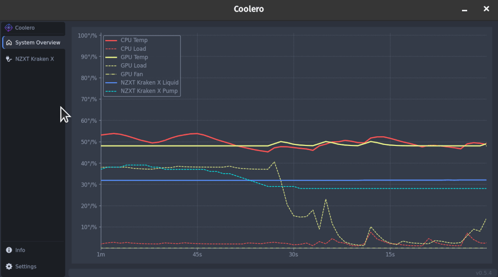

[](https://opensource.org/licenses/)
[](https://gitlab.com/coolero/coolero/-/commits/main)
[](https://gitlab.com/coolero/coolero/pipelines)
[](https://discord.gg/MbcgUFAfhV)
[]()
[]()
[](CODE_OF_CONDUCT.md)

# Coolero

is a program to monitor and control your cooling devices.  
It offers an easy-to-use user interface with various control features and also provides live thermal performance
details.

It is a frontend and enhancement of [liquidctl](https://github.com/liquidctl/liquidctl)
and [hwmon](https://hwmon.wiki.kernel.org) with a focus on cooling device control under Linux.  
Written in [Python](https://www.python.org/) it uses [PySide](https://wiki.qt.io/Qt_for_Python) for the UI
and [Poetry](https://python-poetry.org/) for dependency management.

This project is currently in active development and slowly working it's way towards it's first major release.

## Contents

[[_TOC_]]

## Features

- System Overview Graph - choose what to focus on and see the effects of your configuration changes live and over time.
- Supports multiple devices and multiple versions of the same device.
- Internal profile scheduling - create speed profiles based on CPU, GPU or other device temperature sensors that aren't
  natively supported by the devices themselves.
- Last set profiles are saved and applied at startup.
- Settings are re-applied after waking from sleep/hibernate.
- A modern custom UI.
- Supports most __liquidctl__ [supported devcies](https://github.com/liquidctl/liquidctl#supported-devices).
- Supports usable __hwmon__ (lm-sensors)
  [supported devices](https://hwmon.wiki.kernel.org/device_support_status).

## Demo



## Current Supported Devices

_Note: Some devices are only partially supported or considered experimental_

| Name                                                                               | Notes                                                                                                                           |
|------------------------------------------------------------------------------------|---------------------------------------------------------------------------------------------------------------------------------|
| HWMon (lm-sensors) [devices](https://hwmon.wiki.kernel.org/device_support_status)  | <sup>[see doc](#hwmon-support)</sup>                                                                                            |
| NZXT Kraken Z (Z53, Z63 or Z73)                                                    | <sup>partial, no LCD support [see liquidctl](https://github.com/liquidctl/liquidctl/blob/main/docs/kraken-x3-z3-guide.md)</sup> |
| NZXT Kraken X (X53, X63 or X73)                                                    |                                                                                                                                 |
| NZXT Kraken X (X42, X52, X62 and X72)                                              |                                                                                                                                 |
| NZXT Kraken X31, X41, X61                                                          |                                                                                                                                 |
| NZXT Kraken X40, X60                                                               | <sup>experimental [see liquidctl](https://github.com/liquidctl/liquidctl/blob/main/docs/asetek-690lc-guide.md)</sup>            |
| NZXT Kraken M22                                                                    | <sup>lighting only device</sup>                                                                                                 |
| NZXT HUE 2, HUE 2 Ambient                                                          | <sup>lighting only device</sup>                                                                                                 |
| NZXT Smart Device V2                                                               |                                                                                                                                 |
| NZXT RGB & Fan Controller                                                          |                                                                                                                                 |
| NZXT Smart Device                                                                  |                                                                                                                                 |
| NZXT Grid+ V3                                                                      |                                                                                                                                 |
| NZXT E500, E650, E850                                                              | <sup>partial [see liquidctl](https://github.com/liquidctl/liquidctl/blob/main/docs/nzxt-e-series-psu-guide.md)</sup>            |
| Corsair Hydro GT/GTX H80i, H100i, H110i                                            | <sup>experimental [see liquidctl](https://github.com/liquidctl/liquidctl/blob/main/docs/asetek-690lc-guide.md)</sup>            |
| Corsair Hydro v2 H80i, H100i, H115i                                                |                                                                                                                                 |
| Corsair Hydro Pro H100i, H115i, H150i                                              |                                                                                                                                 |
| Corsair Hydro Platinum H100i, H100i SE, H115i                                      |                                                                                                                                 |
| Corsair Hydro Pro XT H60i, H100i, H115i, H150i                                     |                                                                                                                                 |
| Corsair iCUE Elite Capellix H100i, H115i, H150i                                    | <sup>experimental [see liquidctl](https://github.com/liquidctl/liquidctl/blob/main/docs/corsair-commander-core-guide.md)</sup>  |
| Corsair Commander Pro                                                              |                                                                                                                                 |
| Corsair Commander Core                                                             | <sup>experimental [see liquidctl](https://github.com/liquidctl/liquidctl/blob/main/docs/corsair-commander-core-guide.md)</sup>  |
| Corsair Obsidian 1000D                                                             |                                                                                                                                 |
| Corsair Lighting Node Core, Pro                                                    | <sup>lighting only device</sup>                                                                                                 |
| Corsair HX750i, HX850i, HX1000i, HX1200i                                           |                                                                                                                                 |
| Corsair RM650i, RM750i, RM850i, RM1000i                                            |                                                                                                                                 |
| EVGA CLC 120 (CL12), 240, 280, 360                                                 |                                                                                                                                 |
| Gigabyte RGB Fusion 2.0                                                            | <sup>lighting only device</sup>                                                                                                 |

Your device isn't listed? See [Adding Device Support](#adding-device-support)

## Installation

Installation is currently supported by __AppImage__, __Flatpak__, the __AUR__ and from __Source__

### AppImage

[](https://gitlab.com/api/v4/projects/30707566/packages/generic/appimage/latest/Coolero-x86_64.AppImage)  
Use the above link or goto the [Releases](https://gitlab.com/coolero/coolero/-/releases) page and download a specific
version.  
The AppImage contains all the needed dependencies. Just make it executable and run it:

```bash
chmod +x Coolero-x86_64.AppImage
./Coolero-x86_64.AppImage
```

_Note: on some systems you'll have to install 'fuse' to make appimages work_  
It's recommended to turn on **Check for updates** in Settings, which is disabled by default. Coolero will then ask if
you want to update it automatically if a newer version is available.

<details>
<summary>Click for more info about AppImages</summary>

<a href="https://appimage.org/">AppImage Website</a><br>

For improved desktop integration:
<ul>
    <li><a href="https://github.com/TheAssassin/AppImageLauncher">AppImageLauncher</a></li>
    <li><a href="https://github.com/probonopd/go-appimage/blob/master/src/appimaged/README.md">appimaged</a></li>
</ul>
</details>

### Flatpak

You can checkout the [Coolero page on Flathub](https://flathub.org/apps/details/org.coolero.Coolero)

or install from the command line:

```commandline
flatpak install org.coolero.Coolero
```

### AUR

Use your installed AUR Helper, i.e.:

```commandline
yay -S coolero
```

### Source

<details>
<summary>Click to view</summary>

#### Requirements

* Linux
* [Python 3.10](https://www.python.org/)
    * including the python3.10-dev package (may already be installed)

#### System Packages

* Ubuntu:
    ```bash
    sudo apt install libusb-1.0-0 curl python3-virtualenv python3.10-venv python3.10-dev build-essential libgl1-mesa-dev
    ```
* Fedora:
    ```bash
    sudo dnf install libusbx curl python3-virtualenv python3-devel mesa-libGL-devel && sudo dnf groupinstall "C Development Tools and Libraries"
    ```
* More specifically:
    * LibUSB 1.0 (libusb-1.0, libusb-1.0-0, or libusbx from your system package manager)
    * curl
    * python3-virtualenv  (or python3.10-virtualenv)
    * python3-venv  (or python3.10-venv)
    * Packages needed to build Qt applications:
        * build-essential
        * libgl1-mesa-dev

#### [Poetry](https://python-poetry.org/)

* install:
    ```bash
    curl -sSL https://raw.githubusercontent.com/python-poetry/poetry/master/install-poetry.py | python3 -
    ```
* run: `poetry --version` to make sure poetry works
* if needed, add `$HOME/.local/bin` to your PATH to execute poetry easily:
    ```bash
    export PATH=$HOME/.local/bin:$PATH
    ```
* if Python 3.10 is not your default python installation, then run the following in the project directory to give poetry
  access:
    ```bash
    poetry env use python3.10
    ```

#### Coolero Files

* Clone the Repo:
    ```bash
    git clone git@gitlab.com:coolero/coolero.git
    ```
* Install the dependencies from the newly created repo directory:
    ```bash
    poetry install
    ```
* run it:
    ```bash
    poetry run coolero
    ```

</details>

## Usage Hints

- Scroll or right-click on the system overview to zoom the time frame.
- Clicking anywhere in the control graphs will apply the current settings. Changing any setting will apply it
  immediately.
- Check the info and settings pages for some Quality of Life options.

## HWMon Support

Hwmon support comes with features that are similar to programs
like [fancontrol](https://linux.die.net/man/8/fancontrol) and thinkfan. For more info checkout
the [HWMon wiki](https://hwmon.wiki.kernel.org/projectinformation).
By default, all detected and usable fan/pump controls are displayed. Changing Hwmon values requires running a coolero
daemon 'coolerod' as a privileged user. This enables features like custom speed profiles, etc.

### How To

- Enable the Setting: "Hwmon Write Access"
- Optionally enable "Hwmon Temps" to see all available and usable temp sensors
- restart Coolero

### Improved Experience

- (Recommended) Load all available drivers:
    - Install [lm-sensors](https://github.com/lm-sensors/lm-sensors) (lm_sensors) if not already installed. This is
      usually done through
      your distribution's package manager, i.e. apt, dnf, pacman.
        - verify by running `sensors`
        - run `sudo sensors-detect` at least once to make sure all available modules have been loaded.
- (Arch Only) Systemd Service:
    - _Info:_ This enables a systemd service so that you don't have to put in your password every time coolero starts up
      and is
      currently only supported for AUR and Source installations on Arch Linux. Other system packages like deb and rpm
      are a WIP. Portable/sandboxed installations like AppImage and Flatpak don't offer this functionality.  
      _Note: the daemon currently does not adjust any settings by itself. Implementing that functionality and
      decoupling from the gui are planned for a future release._
    - AUR
        - Install the AUR package normally.
        - Make sure the `coolero` group has been created: ```sudo systemd-sysusers```
        - Add your user to the group: ```sudo usermod -aG coolero $USER```
        - Log out and log back in so that your group membership is re-evaluated.
        - Enable the service on boot: ```sudo systemctl enable coolerod.service```
        - Start the service: ```sudo systemctl start coolerod.service```
    - Source
        - Install from Source as outlined above.
        - Install the python system dependencies
            - The easiest way is to install Coolero from the AUR ```yay -S coolero``` to get all required system
              dependencies,
              then uninstall just coolero ```yay -R coolero```
        - Run ```make install-system```. This will build and install Coolero from the virtual env to the system, install
          the systemd unit files, and enable the service.
        - Log out and log back in so that your group membership is re-evaluated.
        - To uninstall run ```make uninstall-system``` (system libraries will still be present)

### Additional Info

- Coolero does not display all possible sensors and devices. It finds what is usable by the program and displays
  those.  
  The criteria are basically:
    - fans that are controllable
    - temperatures with reasonable values
    - devices that have sensors that meet those requirements.
- Setting the hwmon speed profile to __'Default'__, or simply exiting Coolero will re-enable automatic mode for those
  fans that are set to automatic by default.
- Some fans work in steps, like with the thinkpad, so the reported fan duty % will be the closest step to what one has
  set.
- Devices that are supported by Liquidctl will not be displayed as Hwmon devices. This is because liquidctl offers many
  more features, such as lighting control, than what hwmon alone currently does.

### Known Issues

- The system overview graph will freak out if the sensor list is longer than the current window size can display. Please
  make the window larger and the graph will fix itself.

## CLI Arguments

- `-h, --help`: show available commands
- `-v, --version`: show program and system version information
- `--debug`: turn on debug output to console and logfile
- `--add-udev-rules`: re-add recommended udev rules to the system
- `--export-profiles`: export the last applied profiles for each device and channel

## Debugging

To help diagnose issues enabling debug output is invaluable. It will produce quite a bit of output from the different
internal systems to help determine what the cause might be. Output is sent to the command line (stdout) and to a
rotating temporary log file under `/tmp/coolero/coolero.log` for convenience. Simply add the `--debug` option.

#### AppImage

`./Coolero-x86_64.AppImage --debug`

#### Flatpak

`flatpak run org.coolero.Coolero --debug`  
log file location: `$XDG_RUNTIME_DIR/app/org.coolero.Coolero/coolero/coolero.log`

#### From Source

`poetry run coolero --debug`

## Adding Device Support

Support for new devices requires help from the community. Coolero is essentially a frontend for various "backend"
libraries. This means Coolero does not interact with the devices directly,
but through the API of other systems or libraries. The two currently supported backends are liquidctl and hwmon. Adding
support for more devices generally means being supported in one of these backends first. These are the steps to take to
add support for your device in Coolero:

1. Is your device supported by liquidctl?
    - Go [here](https://github.com/liquidctl/liquidctl#supported-devices) and see if your device is listed.
        - Yes -> make a feature request for Coolero to add support for that device.
        - No -> continue

2. Is your device supported by hwmon?
    - Check [here](https://hwmon.wiki.kernel.org/device_support_status) to see if you can find your device and/or follow
      the [hwmon support guide](#hwmon-support) to see if you see your device is listed in the `sensor` command output.
        - Yes -> you should see the supported controls once you've enabled [HWMon support](#hwmon-support). If your
          device doesn't work as expected make a feature request to add or fix support for it.
        - No -> continue

3. Not supported by the above? There are still some options:
    1. See if another library does support communicating with the device and make a feature request to have Coolero
       integrate support for it.
    2. Support development of a driver for the device by
       contributing: see [liquidctl docs](https://github.com/liquidctl/liquidctl/tree/main/docs)
       or the [lm-sensors repo](https://github.com/lm-sensors/lm-sensors.git).
4. Once support has been added:
    - please report any bugs you notice using the device, real world device testing and feedback is very helpful.

## Acknowledgements

* Major thanks is owed to the python API of [liquidctl](https://github.com/liquidctl/liquidctl)
* Thanks to all the many contributors of [HWMon](https://hwmon.wiki.kernel.org/projectinformation)
* A big inspiration is [GKraken](https://gitlab.com/leinardi/gkraken) written by Roberto Leinardi.
* UI based on [PyOneDark](https://github.com/Wanderson-Magalhaes/PyOneDark_Qt_Widgets_Modern_GUI) by Wanderson M.Pimenta

## License

This program is licensed under [GPLv3](LICENSE)  
also see [the copyright notice](COPYRIGHT.md)

## FAQ

- Should I use Liquid or CPU as a temperature source to control my pump/fans?
    - Quick answer: Liquid
    - The thermodynamics of liquid cooling are very different compared to the traditional method. Choose what works best
      for your situation.
- My UDev rules are messed up, how do I apply them again?
    - run Coolero from the command line with `--add-udev-rules` to have them re-applied
- I have an issue with X, what do I do?
    - Please join the discord channel if it's something small, otherwise opening an Issue ticket in GitLab is the best
      way to get something fixed.
- How do I get Coolero to start automatically when I start my computer?
    - Each distro has their own way to do this, from a simple menu option 'Startup Applications' to writing your own
      script
- Why should I use this GUI when I could do what Coolero does with a shell script?
    - Oh, you definitely can, and I would encourage you to do so. Coolero started out as a dynamic replacement for some
      of my own scripts with the added advantage of being able to visualize the data I was collecting.