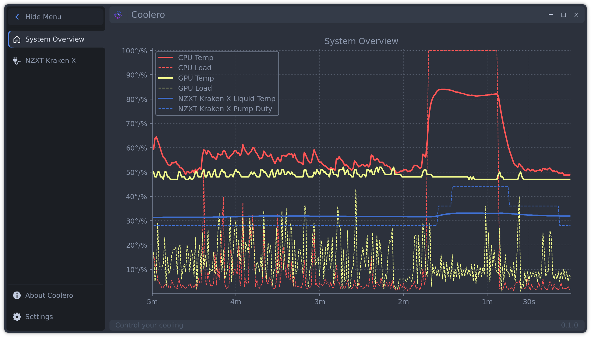
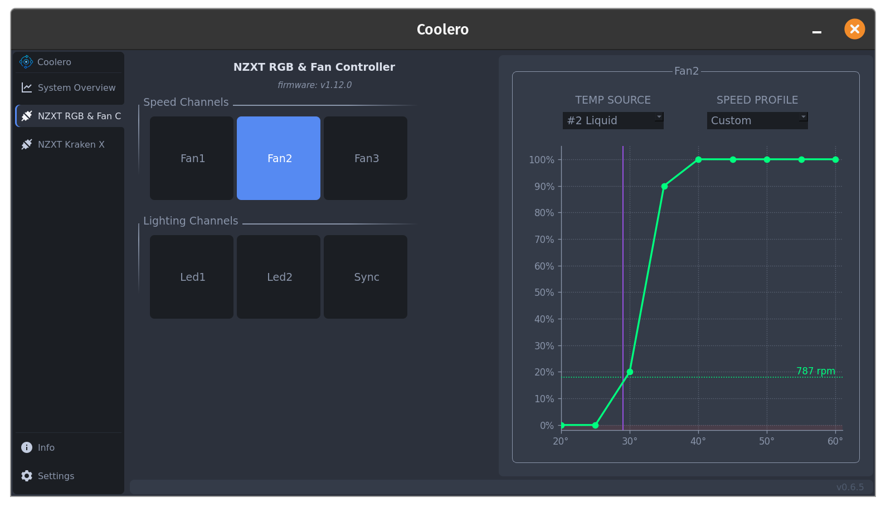
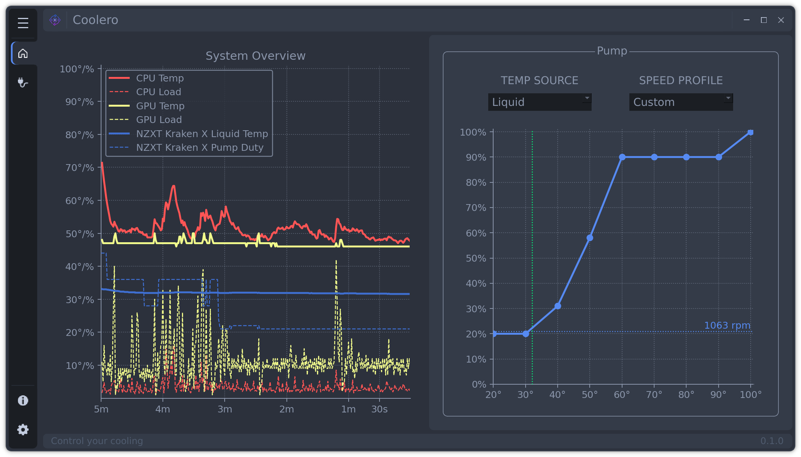

[](https://opensource.org/licenses/)
[](https://gitlab.com/codifryed/coolero/pipelines)

# Coolero

is a program to monitor and control your cooling and other devices.  
It's fundamentally a GUI wrapper for some great cli libraries such
as [liquidctl](https://github.com/liquidctl/liquidctl) and others with a focus on cooling control under Linux.  
Written in [Python](https://www.python.org/) 3.9, it uses [PySide](https://wiki.qt.io/Qt_for_Python) for the UI,
and [Poetry](https://python-poetry.org/) for dependency management.

This project is currently in active development and is slowly working it's way towards an initial stable release.
Testers welcome!

## Screenshots





## Supported Devices:

| Name | Cooling | Lighting | Notes |
|------|---------|----------|-------|
| NZXT Kraken X53, X63, X73 | X |  | |

## Installation

### From Source:

Installing from source is currently the only supported method. Packaging and other methods are on their way.

#### Requirements:

* Linux
* [Python 3.9](https://www.python.org/)
  * including the python3.9-dev package (may already be installed)
* LibUSB 1.0 (libusb-1.0, libusb-1.0-0, or libusbx from your system package manager)
* curl and python3-virtualenv packages
* Packages needed to build Qt applications: 
  * Ubuntu: ```sudo apt install build-essential libgl1-mesa-dev```
* [Poetry](https://python-poetry.org/) -
    * Make sure `python` is symlinked to your python3 installation - `alias python=python3`
    * run `curl -sSL https://raw.githubusercontent.com/python-poetry/poetry/master/install-poetry.py | python -`
    * run `poetry --version` to make sure poetry works
    * if needed, add `$HOME/.local/bin` to your PATH to execute poetry easily - `export PATH=$HOME/.local/bin:$PATH`
    * if Python 3.9 is not your default python installation, then run `poetry env use python3.9` to give poetry access

#### How:

* Clone the Repo `git clone git@gitlab.com:codifryed/coolero.git`
* Install the dependencies:
    ```bash
    cd coolero
    poetry install
    ```
* run it: `poetry run coolero`

## Debuging

`poetry run coolero --debug`
*this will produce a lot of debug output

## Credits

* A major inspiration and where this projects stems from is [GKraken](https://gitlab.com/leinardi/gkraken) written by
  Roberto Leinardi. This project started out as a rewrite of GKraken to be able to support a many more devices and
  configurations.
* UI based on [PyOneDark](https://github.com/Wanderson-Magalhaes/PyOneDark_Qt_Widgets_Modern_GUI) by Wanderson M.Pimenta

## License

This program is licensed under [GPLv3](COPYING.txt)  
also see [the copyright notice](COPYRIGHT.md)