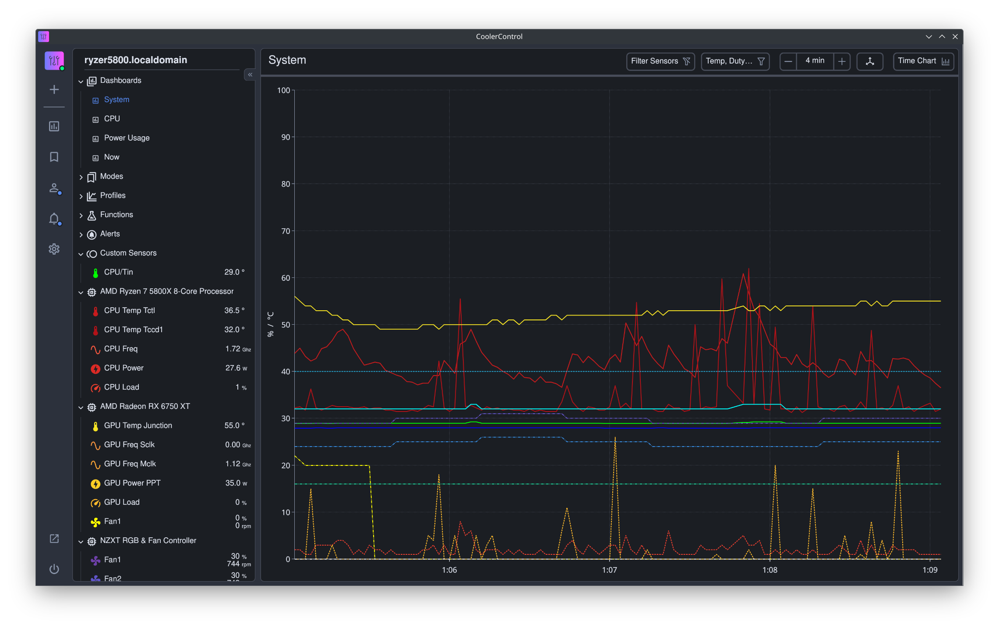

<!-- trunk-ignore(markdownlint/MD041): First line should be heading -->
<div align="center">
  <h1>
  
  <br>
  <span style="@font-face { font-family: Delicious; src: url('coolercontrol-ui/public/Rounded_Elegance.woff'); };font-size: 2em;font-family: rounded, Roboto, Helvetica, Arial, sans-serif;">CoolerControl</span>
  <br>
  <br>
  </h1>

<!-- trunk-ignore-begin(markdownlint)-->

[]()
[]()
[]()
[]()
[](https://opensource.org/licenses/)

[](https://discord.gg/MbcgUFAfhV)
[](https://gitlab.com/coolercontrol/coolercontrol/pipelines)

<!-- trunk-ignore-end(markdownlint)-->

<!--  -->


</div>

<br>
<div align="center">
Main Navigation:
</div>
<div align="center">

[Features](#what-features-does-it-have) - [Getting Started](#how-do-i-get-started) -
[Hardware Support](#why-is-my-hardware-not-showing) -
[Issues](#what-do-i-do-if-i-have-a-problem-or-question) - [Contributing](#how-can-i-contribute) -
[Acknowledgements](#acknowledgements) - [License](#license) - [Related Projects](#related-projects)

</div>
<div align="center">

[The Wiki Pages](https://gitlab.com/coolercontrol/coolercontrol/-/wikis/home)

</div>

## What Is This?

CoolerControl is a feature-rich cooling device control application for Linux. It has a system daemon
for background device management, as well as a GUI to expertly customize your settings.

## What Features Does It Have?

- A highly configurable GUI with system overview
- A control daemon that runs in the background
- Auto detection of hwmon/sysfs and liquidctl devices including some laptops
- Enhanced liquidctl device support (AIOs, USB Fan hubs, LCD screens, RGB lighting, etc)
- Fan control support for most NVidia and AMD GPUs
- Fully customizable speed `Profiles` like Fixed, Graph(Curve), and Mix that can be applied to
  multiple fans
- `Functions` to control how a Profile is applied with hysteresis, threshold, directional, and
  response time control
- System-wide cooling `Modes` to adjust all your devices at once
- Create your own `Custom Sensors` based on a File or on a combination of temperature sensors
- Combine `Profiles` from multiple devices for complete cooling coverage
- Re-applies settings after waking from sleep
- External monitoring and GUI support
- Comprehensive REST API for extensions

## How do I Get Started?

CoolerControl is made up of several sub-packages:

1. `coolercontrold` - the main daemon and systemd service that handles controlling your hardware.
2. `coolercontrol-liqctld` - a systemd service layer over `liquidctl`.
3. `coolercontrol` - the standalone GUI desktop application.

\#1 and \#2 are required. \#3 is technically optional, as the GUI can also be accessed from the
daemon using a browser.

You'll want to first install the application packages following the
[installation](#how-do-i-install-it) steps below and then you can access the GUI in one of two ways:

1. Open the standalone GUI application `coolercontrol` from your desktop.
2. Open a browser and go to [http://localhost:11987](http://localhost:11987)

The following are some recommended steps to become familiar with the UI and how to create your
customized settings:

1. Explore the UI Menu on the left. Notice what clicking on each menu item does and the little
   options menus available for each one.
2. Click on "Profiles & Functions". Notice the small `info` icons next to the headings. Hover over
   them for more information. Lots of things in the UI you can hover over for more details.
3. Open the Settings menu by clicking on the settings icon in the upper right hand corner. Notice
   how you can hover over most settings for an explanation of what each one does.
4. Start creating `Profile`s and `Function`s, exploring their settings, and apply them to your
   desired fans or pumps.
5. Create Modes to be able to swap out your profiles when desired.

_\*Note: You can modify and control the daemon using its config file, but that is not officially
supported._

## How do I Install It?

- [AppImage](#appimage)
- [AUR](#aur)
- [Ubuntu/Debian Based](#debian)
- [Fedora](#fedora)
- [OpenSuse Tumbleweed](#opensuse-tumbleweed)
- [Nix](#nix)
- [From Source](#source)

## Why is my hardware not showing?

CoolerControl depends on [Hwmon](https://hwmon.wiki.kernel.org/projectinformation) kernel drivers
and [liquidctl](https://github.com/liquidctl/liquidctl) to access and control supported hardware.
Note that your hardware is not guarenteed to be supported, as this depends on open-source drivers
and contributors. These are some steps you can take to maximize hardware coverage:

- To have all available kernel modules installed for your hardware it's recommended to install
  `lm-sensors` and to run `sudo sensors-detect`. For more details see the
  [Arch Wiki](https://wiki.archlinux.org/index.php/Lm_sensors#Installation) and the
  [HWMon Support section](https://gitlab.com/coolercontrol/coolercontrol/-/wikis/HWMon-Support).
  Additionally, you can check out the official
  [lm-sensors repository](https://github.com/lm-sensors/lm-sensors/issues) for tips on manually
  loading unofficial kernel modules for certain devices.
- For newer motherboards and cards it's best to install the latest available kernel for your
  distribution which includes the latest Hwmon drivers and kernel modules.
- Check the [liquidctl hardware support list](https://github.com/liquidctl/liquidctl) for the state
  of support for USB devices like fan hubs and AIOs.
- NVidia GPUs - Fan control is currently tested working for most cards and setups. Make sure that
  `nvidia-settings` and `nvidia-smi` are installed. On some distributions this is done automatically
  with the driver installation, on others you need to install them manually.
- Laptops - ThinkPads, some ASUS, and some HP Laptops are known to work. If your laptop has a hwmon
  kernel driver, then CoolerControl will use it. Otherwise, fan control for your laptop is most
  likely not supported.
- CoolerControl will detect supported devices and available capabilities automatically. The GUI will
  also prompt you for additional steps if necessary. There are some situations where the kernel
  drivers are not yet mature enough to offer control functionality, in which cases an error is
  returned when attempting to apply changes.

## AppImage

[](https://gitlab.com/coolercontrol/coolercontrol/-/releases/permalink/latest/downloads/packages/CoolerControlD-x86_64.AppImage)
[](https://gitlab.com/coolercontrol/coolercontrol/-/releases/permalink/latest/downloads/packages/CoolerControl-x86_64.AppImage)

There are two AppImages:  
`CoolerControlD` which runs as a daemon in the background and needs sudo access.  
`CoolerControl` which is the standalone GUI application. (Optional)

To download them you can use either of the above links or goto the
[Releases](https://gitlab.com/coolercontrol/coolercontrol/-/releases) page to download a specific
version.

The AppImages are helpful if you want to try things out without installing anything. It is generally
recommended to install the systems packages, as it is then installed as a systemd service which
starts at boot and version updates are handled automatically.

The AppImages contain most of the needed dependencies\*. Just make it executable and run it:

```bash
chmod +x CoolerControlD-x86_64.AppImage
chmod +x CoolerControl-x86_64.AppImage
# start daemon in the background
sudo ./CoolerControlD-x86_64.AppImage &
./CoolerControl-x86_64.AppImage
```

_\* :warning: on some systems you'll have to install `libfuse2` or `fuse` for appimages to work._

<details>
<summary>Click for more info about AppImages</summary>

<a href="https://appimage.org/">AppImage Website</a><br>

For improved desktop integration:

<ul>
    <li><a href="https://github.com/TheAssassin/AppImageLauncher">AppImageLauncher</a></li>
    <li><a href="https://github.com/probonopd/go-appimage/blob/master/src/appimaged/README.md">appimaged</a></li>
</ul>
</details>

## AUR

[](#aur)
[](#aur)  
[](https://aur.archlinux.org/packages/coolercontrol)

Use your installed AUR Helper, i.e.:

```bash
yay -S coolercontrol
```

Then enable and start the systemd service:

```bash
sudo systemctl enable --now coolercontrold
```

## Packages

[](https://cloudsmith.com)

Package repositories for some distros is graciously provided by
[Cloudsmith](https://cloudsmith.com) - a fully hosted, cloud-native, universal package management
solution.

## Debian

[](#debian)
[](#debian)
[](#debian)
[](#debian)
[](https://cloudsmith.com)

Debain packages are supported for the following distros:

- \>= Debian Bookworm
- \>= Ubuntu 22.04 (Jammy)
- Most other distributions based on the above.
- Kali Linux is currently **not** supported due to a limitation with their official package
  repository. Kali users will need to either use the [AppImage](#appimage) or install from
  [source](#source).

You can quickly setup the Cloudsmith repository automatically (recommended):  
_\*[Other Cloudsmith Options](#cloudsmith-options)_

Make sure `curl` is installed:

```bash
sudo apt install curl apt-transport-https
```

```bash
curl -1sLf \
  'https://dl.cloudsmith.io/public/coolercontrol/coolercontrol/setup.deb.sh' \
  | sudo -E bash
```

```bash
sudo apt update
sudo apt install coolercontrol
```

```bash
sudo systemctl enable --now coolercontrold
```

### Ubuntu 24.04 LTS - Noble

The latest release of Ubuntu has removed some of the upstream dependencies that CoolerControl
currently has. To install on 24.04 Noble you'll need a workaround until the upstream dependencies
have been updated:

1. Instead of the above line: `sudo apt install coolercontrol`, use: (notice the "d")
   ```bash
   sudo apt install coolercontrold
   ```
2. That will install the daemons only, and then you can either use the WebUI at:
   [http://localhost:11987](http://localhost:11987) or download the
   [UI AppImage](https://gitlab.com/coolercontrol/coolercontrol/-/releases/permalink/latest/downloads/packages/CoolerControl-x86_64.AppImage).

### Ubuntu 22.04 LTS (Optional)

The Ubuntu package `liquidctl` is outdated. Therefore, some devices might not show, such as the
`NZXT Smart Device V2`. To fix this, you can force upgrade the package:

> ⚠️ **Before proceeding, make sure to run the commands outlined [above](#debian).**

```bash
sudo systemctl stop coolercontrold
sudo pip install liquidctl --upgrade
sudo systemctl start coolercontrold
```

<!-- trunk-ignore-begin(markdownlint/MD036): Emphasis used instead of heading -->

_You might need to restart your computer for the changes to take effect_

<!-- trunk-ignore-end(markdownlint/MD036) -->

## Fedora

[](#fedora)
[](#fedora)  
[](#fedora)

There is a Copr repository available for Fedora based distributions:

```bash
# make sure you have the necessary plugin:
sudo dnf install dnf-plugins-core
sudo dnf copr enable codifryed/CoolerControl
sudo dnf install coolercontrol
sudo systemctl enable --now coolercontrold
```

## OpenSuse Tumbleweed

[](#opensuse-tumbleweed)  
[](https://build.opensuse.org/package/show/home:codifryed/coolercontrol)

Packaging is done on the Open Build Service for openSuse Tumbleweed and there are two easy ways to
install the packages:

1. You can use the
   [1-Click-Install](https://software.opensuse.org/ymp/home:codifryed/openSUSE_Tumbleweed/coolercontrol.ymp)
   method.
2. Or install from the command line:

```bash
# make sure opi is installed if it's not already:
sudo zypper install opi
opi coolercontrol
```

Then enable and start the systemd service:

```bash
sudo systemctl enable --now coolercontrold
```

## Nix

[](#nix)

The coolercontrol package is currently a part of the `nixpkgs-unstable` and `nixos-unstable`
channels.

For NixOS there are is a configuration option available, which should install the application and
enable the services:

```nix
programs.coolercontrol.enable = true;
```

And an option for NVidia graphic card owners that should default to on if you have the nvidia driver
in `services.xserver.videoDrivers`:

```nix
programs.coolercontrol.nvidiaSupport = true;
```

If installing using the Nix package manager on a non-NixOS distro, you'll need to do some things
manually. For example:

```bash
# Make sure your channel is up to date
nix-channel --update
nix-env -iA nixpkgs.coolercontrol
sudo systemctl enable --now ~/.nix-profile/lib/systemd/system/coolercontrold.service ~/.nix-profile/lib/systemd/system/coolercontrol-liqctld.service
```

:warning: On non-NixOS, this will enable the services for the currently installed version. You need
to disable the services and re-enable them after each update. `systemctl reenable` will not work.

<!-- ## Gentoo

[](#opensuse-tumbleweed)   -->

## Cloudsmith Options

For other options, such as if you need to force a specific distribution, release/version, or you
want to do the steps manually, check out the
[CoolerControl repository on Cloudsmith](https://cloudsmith.io/~coolercontrol/repos/coolercontrol/setup/).
When running a distribution that is based on another, but not natively supported by Cloudsmith, you
can use the base-distribution repository. For example:

```bash
curl -1sLf \
  'https://dl.cloudsmith.io/public/coolercontrol/coolercontrol/setup.rpm.sh' \
  | sudo -E distro=fedora codename=38 bash
```

#### Repository Alternative <!-- trunk-ignore(markdownlint/MD001): Emphasis used instead of heading -->

You can download the package files directly from the
[Releases Page](https://gitlab.com/coolercontrol/coolercontrol/-/releases) and install the packages
manually.

## Source

[](#source-wip)

### Requirements

- git
- make
- cargo >= 1.75.0
- python >= 3.8
- nodejs >= 18.0.0
- npm

_Note:_ If you are running Arch Linux, installing from source requires special steps that the
official AUR package already does for you.

### System Packages

To optionally build the standalone GUI application you'll also need
[these Tauri development packages](https://tauri.app/v1/guides/getting-started/prerequisites/#setting-up-linux).

### Setup Source

```bash
git clone https://gitlab.com/coolercontrol/coolercontrol.git
git checkout main
git pull
```

### Build and Install Everything

```bash
cd coolercontrol
make install-source -j3
# and watch it go.
```

That should install all the needed files onto your system.

Then start the daemons:

```bash
sudo systemctl daemon-reload
sudo systemctl enable --now coolercontrold
```

You should then be able to start the GUI like normal.

---

<br/>

# What Do I Do If I Have A Problem Or Question?

If you are experiencing an issue or have a feature request, please open up an
[issue in GitLab](https://gitlab.com/coolercontrol/coolercontrol/-/issues) and use one of the
provided templates. When submitting a bug
[daemon logs](https://gitlab.com/coolercontrol/coolercontrol/-/wikis/Log-Output-&-Debugging#to-capture-log-output-to-a-file)
are invaluable to determining the cause. If you have a general question, please join the discord
channel where community members can also help.

# How Can I Contribute?

:heart: CoolerControl is in need of help with the following areas:

- Packaging
- Website
- Spreading the word

If you have an idea or want to submit some changes, it's usually best to either submit an Issue
ticket first or get on Discord to discuss it. For general information please read the
[contributing guidelines](https://gitlab.com/coolercontrol/coolercontrol/-/blob/main/CONTRIBUTING.md).

# Acknowledgements

- Major thanks is owed to the python API of [liquidctl](https://github.com/liquidctl/liquidctl)
- Thanks to all the many contributors of [HWMon](https://hwmon.wiki.kernel.org/projectinformation)
- A big inspiration is [GKraken](https://gitlab.com/leinardi/gkraken) written by Roberto Leinardi.

# License

This program is licensed under [GPLv3](LICENSE)

# Related Projects

- [liquidctl](https://github.com/liquidctl/liquidctl)  
  Cross-platform tool and drivers for liquid coolers and other devices.

- [fan2go](https://github.com/markusressel/fan2go)  
  A daemon to control the fans of your computer.

- [thinkfan](https://github.com/vmatare/thinkfan)  
  A simple, lightweight fan control program. (ThinkPads)

- [OpenRGB](https://gitlab.com/CalcProgrammer1/OpenRGB)  
  Graphical interface to control many different types of RGB devices.

- [FanControl](https://github.com/Rem0o/FanControl.Releases)  
  A focused and highly customizable fan controlling software for Windows.
