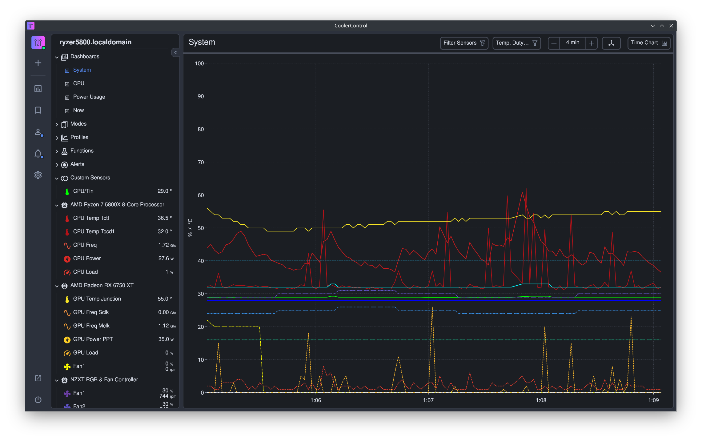

<!-- trunk-ignore(markdownlint/MD041): First line should be heading -->

  <h1>
  
   
  CoolerControl
   
  </h1>

<!-- trunk-ignore-begin(markdownlint)-->

<!-- trunk-ignore-end(markdownlint)-->

 
 

Powerful cooling control and monitoring for Linux 🐧

<!-- trunk-ignore-begin(markdownlint/MD045): links with emojis -->

<!-- trunk-ignore-end(markdownlint/MD045): links with emojis -->

<!--  -->

<h2>

<!-- trunk-ignore-begin(markdownlint/MD051): links with emojis -->

[Install](https://coolercontrol.org/getting-started.html) &middot;
[Hardware Support](https://coolercontrol.org/hardware-support.html) &middot;
[Documentation](https://coolercontrol.org) &middot; [Discord](https://discord.gg/MbcgUFAfhV)

<!-- trunk-ignore-end(markdownlint/MD051): links with emojis -->

</h2>

 

CoolerControl is an open-source application for monitoring and controlling supported cooling devices
on Linux. It features a system daemon with a built-in Web UI, an optional desktop app, and a
comprehensive REST API.

## Features

- System daemon with built-in Web UI and optional desktop application
- Auto-detection of hwmon/sysfs, liquidctl, NVIDIA, and AMD GPU devices
- GPU fan control for most NVIDIA and AMD GPUs
- Customizable `Profiles` (Fixed, Graph, Mix, Overlay) applied to any fan or pump
- `Functions` for hysteresis, thresholds, directionality, and response-time control
- System-wide `Modes` to switch all device settings at once
- `Custom Sensors` from files or combinations of existing sensors
- `Dashboards` and `Alerts` for monitoring and anomaly detection
- Headless and remote access support
- Reapplies settings after sleep

For the full feature set and configuration guides, see the
[documentation](https://coolercontrol.org).

## Installation

See the [Getting Started](https://coolercontrol.org/getting-started.html) page for install
instructions for all supported distributions (Arch, Debian/Ubuntu, Fedora, openSUSE, Nix, Gentoo,
Unraid, Docker, AppImage, and source builds).

## Hardware Support

See the [Hardware Support](https://coolercontrol.org/hardware-support.html) page for details on
motherboard fans, USB AIOs, GPU fan control, laptops, and HDDs.

## Problems and Questions

- Open an [issue on GitLab](https://gitlab.com/coolercontrol/coolercontrol/-/issues) using one of
  the provided templates. Daemon logs are invaluable for bug reports.
- Join the [Discord](https://discord.gg/MbcgUFAfhV) for general questions and community support.

## Contributing

Contributions are welcome. Please open an
[issue](https://gitlab.com/coolercontrol/coolercontrol/-/issues/) or discuss on
[Discord](https://discord.gg/MbcgUFAfhV) before submitting changes. See the
[contributing guidelines](https://gitlab.com/coolercontrol/coolercontrol/-/blob/main/CONTRIBUTING.md)
for details.

## Support

<!-- trunk-ignore-begin(markdownlint)-->

<!-- trunk-ignore-end(markdownlint)-->

## Related Projects

- [liquidctl](https://github.com/liquidctl/liquidctl)  
  Cross-platform tool and drivers for liquid coolers and other devices.

- [fan2go](https://github.com/markusressel/fan2go)  
  A daemon to control the fans of your computer.

- [thinkfan](https://github.com/vmatare/thinkfan)  
  A simple, lightweight fan control program. (ThinkPads)

- [OpenRGB](https://gitlab.com/CalcProgrammer1/OpenRGB)  
  Graphical interface to control many different types of RGB devices.

- [FanControl](https://github.com/Rem0o/FanControl.Releases)  
  A focused and highly customizable fan controlling software for Windows.

## License

This program is licensed under [GPLv3+](LICENSE)
